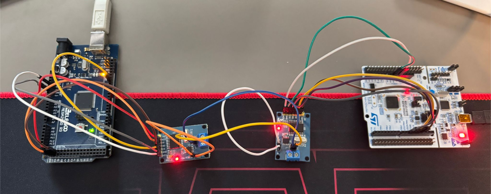

# Can_communication
STM32 Nucleo F401RE + MCP2515 &lt;-> Arduino mega 2560 + MCP2515 project for CAN bus communication, including ISO-TP reassembly and UDS diagnostic service demos.

## 📌 Project Organization

The project is organized into **milestones (A, B, C, D)**.  
Each milestone contains smaller **sub-milestones**, focused on specific development goals (driver setup, protocol testing, UDS implementation, etc.).

- **Milestone A** → Basic CAN setup & loopback tests  
- **Milestone B** → ISO-TP segmentation/reassembly  
- **Milestone C** → UDS diagnostic service layer  
- **Milestone D** → Final integration & robustness testing  

## 📒 Documentation

All development steps, diagrams and notes are tracked in a dedicated **Notion document**.
🔗 [Project Notes on Notion](https://reinvented-hour-246.notion.site/CAN-COMMUNICATION-7c70d8237d704bf4bcac146c4ff31d1f?pvs=143)

## 🔌 Hardware Connections

Below is a picture of the actual board connections (STM32 ↔ MCP2515 ↔ Arduino Mega):

